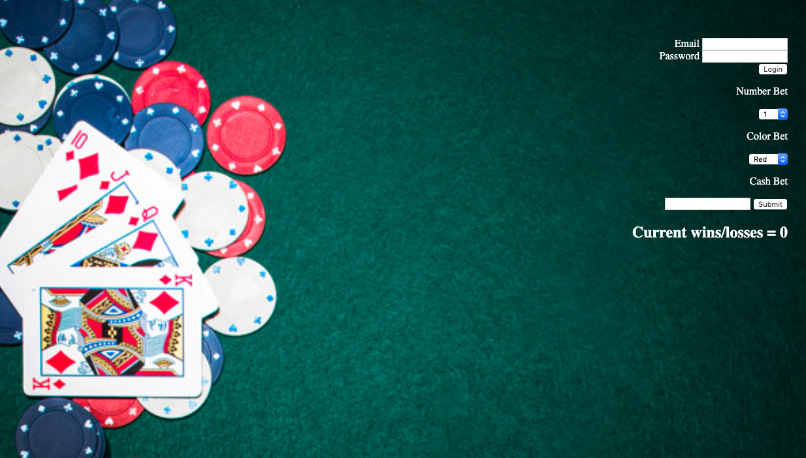
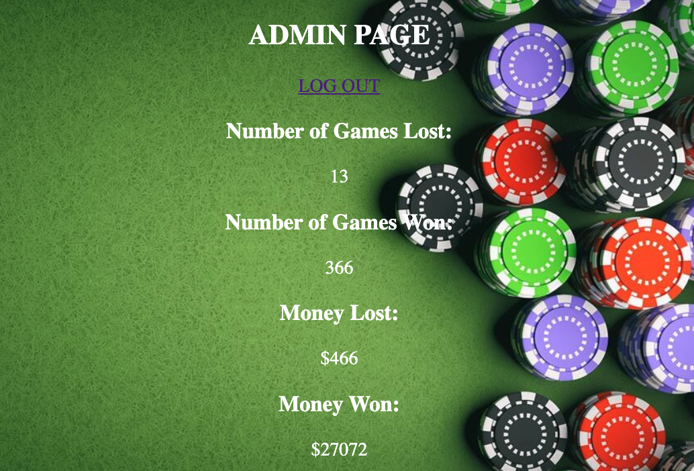

#  🎰 Roulette-App

### App Statement
#### This application allows user to select a number, color and dollar amount that they would like to be.  They will then be notified if they have lost or won.  As well as an update on their wins or losses.  

#### The owner of the casino is also able to log in and check on the status of the casino.  They will see how many times the casino has won or lost games.  As well as the amount of money that has been won or lost.

## Tech Used:
- HTML5
- CSS3
- Javascript
- Node.js
- Express
- Mongo DB
- say.js

## Installation

1. Clone repo
2. run `npm install`

## Usage

1. run `node server.js`
2. Navigate to `localhost:3000`
3. email bossman@yahoo.com  pass 212121
3. Have fun ;)

## Credit

Modified from Scotch.io's auth tutorial
